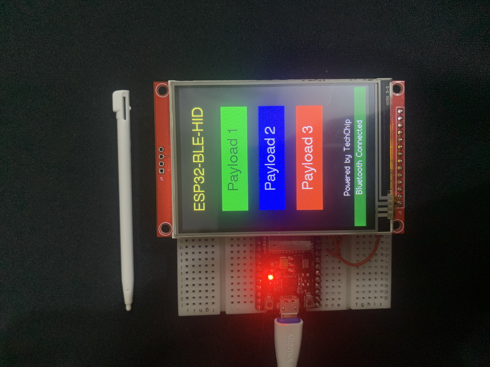
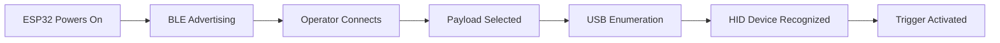
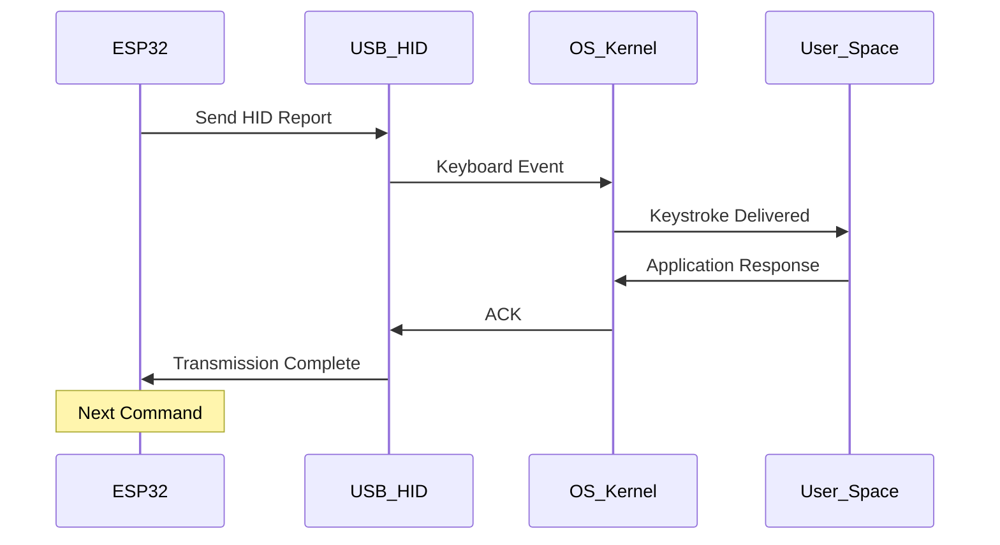

# 🎯 Remote BLE Rubber Ducky – HID-Based Malware Injection Framework

### *Bluetooth-Controlled Human Interface Device Attack Platform for Malware Analysis Research*

---

<div align="center">


</div>

---

## 📚 Academic Context

**Course:** Malware Analysis  
**Semester:** 5th Semester  
**Institution:** University Authorized Laboratory Environment  
**Discipline:** Cybersecurity, Embedded Systems Security, Offensive Security Research  

### 🎓 Research Objectives

This project investigates **Human Interface Device (HID) exploitation techniques** as a vector for malware delivery and execution in modern computing environments. The research explores Bluetooth Low Energy (BLE) as a wireless command channel for remote HID injection attacks, examining detection evasion, payload delivery mechanisms, and behavioral analysis methodologies used in contemporary malware campaigns.

**Primary Goals:**
- Analyze HID attack surface vulnerabilities in operating systems
- Study wireless malware delivery via BLE protocol abuse
- Investigate fileless execution primitives and in-memory payload staging
- Develop detection signatures for HID-based intrusion attempts
- Document mitigation strategies for embedded HID threats

---

## 🔬 Project Overview

The **Remote BLE Rubber Ducky** is an ESP32-based research platform designed for controlled malware analysis studies focusing on **USB HID emulation attacks**. The system implements a remotely triggered keystroke injection framework, enabling researchers to simulate sophisticated social engineering and automated exploitation scenarios within secured laboratory environments.

Unlike traditional USB Rubber Ducky devices requiring physical insertion, this platform leverages **Bluetooth Low Energy (BLE)** for wireless command transmission, allowing dynamic payload triggering, real-time attack orchestration, and behavioral observation from safe distances. The framework supports both headless (GPIO-triggered) and interactive (touchscreen-controlled) deployment configurations.

**Key Research Applications:**
- HID attack surface mapping and vulnerability assessment
- Behavioral malware analysis and endpoint detection response (EDR) testing
- Social engineering simulation and user awareness training
- Embedded security research and IoT threat modeling
- Defensive tool development and signature creation

> ⚠️ **CONTROLLED RESEARCH ENVIRONMENT ONLY**  
> This platform is strictly for authorized academic malware analysis within university-approved laboratory settings. Unauthorized deployment constitutes illegal computer intrusion.

---
  


---

## 🛠️ Project Variants

This research platform exists in **two operational configurations**, each optimized for different analysis scenarios and deployment constraints.

### **Variant 1: Remote BLE Rubber Ducky WITHOUT Screen** 🔘

**Configuration:** GPIO-Triggered, Headless Operation  
**Use Case:** Covert deployment, minimal footprint, pre-configured payload execution

#### Operational Characteristics:
- **Trigger Mechanism:** Physical GPIO button press initiates payload
- **Payload Storage:** Pre-flashed binary burned to ESP32 flash memory
- **Form Factor:** Compact, concealable design for field research
- **User Interface:** LED status indicators only
- **Power Profile:** Low-power standby with on-demand execution
- **Deployment Scenario:** Simulated physical access attacks, unattended execution

#### Technical Architecture:
- Single-button trigger (GPIO configured with internal pull-up)
- BLE advertising for remote connection and monitoring
- Payload stored in dedicated flash partition (0x290000)
- HID keyboard emulation via USB CDC ACM
- Status feedback through onboard LED

#### Hardware Connections
1. Connect one jumper wire from GND pin
2. Connect other jumper wires to GPIO pins: as your requirement.
   - Trigger 1: GPIO 16
   - Trigger 2: GPIO 17
   - Trigger 3: GPIO 18
3. When you want to activate a trigger, touch both jumper wires

#### Software Requirements
- [Arduino IDE](https://www.arduino.cc/en/software/)

#### Arduino IDE Setup
1. Open Arduino IDE Preferences
2. Add ESP32 board URL in Additional Board Manager URLs:
```
   https://espressif.github.io/arduino-esp32/package_esp32_index.json
```
3. Go to Tools -> Board Manager
4. Search for "ESP32" and install version 2.0.15

#### Required Libraries
- **ESP32 BLE Keyboard Library**  
  🔗 [ESP32-BLE-Keyboard by T-vK](https://github.com/T-vK/ESP32-BLE-Keyboard)  
  - Arduino IDE: `Sketch → Include Library → Add .ZIP Library`
  - Import the downloaded `.zip` file


#### Installation

1. Clone this repository:
```bash
   git clone https://github.com/Q3hr/BLE-Rubber-Ducky-with-without-Screen.git
```
2. Open `blehid.ino` in Arduino IDE "Located at the following path: SRC\Remote BLE Rubber Ducky without Screen\blehid"
3. Select your board and port - ESP32-Dev Module
4. Upload the code to your Arduino board

#### Usage

1. Power up your Arduino board
2. The device will start advertising as a BLE HID device
3. Connect to the device from your computer/tablet/phone's Bluetooth settings
4. Activate the trigger

---

### **Variant 2: Remote BLE Rubber Ducky WITH Touchscreen** 📱

**Configuration:** ILI9341 TFT Interactive Interface  
**Use Case:** Dynamic payload selection, real-time attack orchestration, training demonstrations

#### Operational Characteristics:
- **Interface:** 2.4" TFT touchscreen (ILI9341, 320x240 resolution)
- **Payload Management:** On-screen menu for multi-payload selection
- **Real-Time Control:** Dynamic trigger, pause, and abort capabilities
- **Visual Feedback:** Execution status, connection state, target information
- **User Experience:** Intuitive touch-based operation for research demonstrations
- **Deployment Scenario:** Controlled lab exercises, instructor-led simulations

#### Technical Architecture:
- SPI-based TFT display (ILI9341 driver)
- Resistive touch controller integration
- Multi-payload menu system with scrolling
- Visual BLE connection status indicator
- Real-time keystroke injection preview
- Partition-based payload storage (multiple scripts)

---

## ⚡ Feature Breakdown

### 🔑 Core Capabilities

| Feature | Description | Security Implication |
|---------|-------------|---------------------|
| **HID Emulation** | Complete USB keyboard device simulation | Bypasses application-layer security controls |
| **BLE Command Channel** | Wireless trigger and control interface | Enables remote, untethered attack execution |
| **Fileless Execution** | Ducky Script interpreter for in-memory operations | Evades signature-based antivirus detection |
| **Multi-Payload Support** | Switchable attack scripts (touchscreen variant) | Adaptable to diverse target environments |
| **Persistent Storage** | Flash-based payload retention | Survives power cycles, enables repeat attacks |
| **Zero-Click Triggering** | GPIO-based automated execution | Simulates sophisticated malware automation |
| **Cross-Platform** | OS-agnostic HID injection | Universal attack surface across Windows/Linux/macOS |

### 🎯 Attack Primitives Demonstrated

- **Keystroke Injection:** Automated typing at superhuman speeds
- **Code Obfuscation:** Obfuscation of Reverse Shell to fool the Windows 10/11 Defender + the AMSI
- **GUI Manipulation:** Programmatic window navigation and control
- **Command Execution:** Shell/terminal invocation and scripting
- **Data Exfiltration:** Simulated credential harvesting and file theft
- **Persistence Mechanisms:** Registry modification, startup tasks, cron jobs
- **Anti-Forensics:** Event log manipulation, history clearing

---

## 🏗️ System Architecture

### Hardware Architecture
```
┌─────────────────────────────────────────────────────────────┐
│                    ESP32-WROOM-32 MCU                        │
│  ┌─────────────┐  ┌──────────────┐  ┌──────────────┐       │
│  │   BLE 5.0   │  │ USB CDC ACM  │  │ Flash Memory │       │
│  │  Stack      │  │ HID Emulator │  │  4MB QSPI    │       │
│  └──────┬──────┘  └──────┬───────┘  └──────┬───────┘       │
│         │                │                  │                │
│         └────────┬───────┴──────────────────┘                │
│                  │                                           │
│         ┌────────▼────────┐                                  │
│         │  FreeRTOS Core  │                                  │
│         │  Task Scheduler │                                  │
│         └────────┬────────┘                                  │
└──────────────────┼──────────────────────────────────────────┘
                   │
        ┌──────────┴──────────┐
        │                     │
   ┌────▼─────┐        ┌──────▼────────┐
   │  GPIO    │        │  SPI Display  │
   │  Trigger │        │  (ILI9341)    │
   │  Button  │        │  w/ Touch     │
   └──────────┘        └───────────────┘
    Variant 1            Variant 2
```

### Software Architecture
```
┌───────────────────────────────────────────────────────────┐
│                    Application Layer                       │
├───────────────────────────────────────────────────────────┤
│  Payload Engine  │  BLE Server  │  UI Controller (Var 2)  │
│  (Ducky Parser)  │  (GATT)      │  (TFT Menu System)      │
└─────────┬────────┴──────┬───────┴────────┬────────────────┘
          │               │                │
┌─────────▼───────────────▼────────────────▼────────────────┐
│                  Hardware Abstraction Layer                │
├───────────────────────────────────────────────────────────┤
│   USB HID Class  │  BLE Stack   │  SPI Driver  │  GPIO   │
└─────────┬────────┴──────┬───────┴──────┬───────┴─────┬───┘
          │               │              │             │
┌─────────▼───────────────▼──────────────▼─────────────▼───┐
│                    ESP-IDF Framework                      │
│                  (FreeRTOS Kernel)                        │
└───────────────────────────────────────────────────────────┘
```

---

## 🔌 Hardware Components

### Bill of Materials (BOM)

| Component | Specification | Variant 1 | Variant 2 | Purpose |
|-----------|---------------|-----------|-----------|---------|
| **Microcontroller** | ESP32-WROOM-32 (38-pin) | ✅ | ✅ | Core processing, BLE, USB HID |
| **TFT Display** | ILI9341 2.4" 320x240 SPI | ❌ | ✅ | Interactive payload selection |
| **Touch Controller** | Resistive 4-wire | ❌ | ✅ | User input interface |
| **Trigger Button** | Tactile push-button | ✅ | ❌ | GPIO-based payload execution |
| **USB Cable** | Micro-USB to USB-A | ✅ | ✅ | Target connection & power |
| **Power Supply** | 5V DC (USB-powered) | ✅ | ✅ | System power |
| **Enclosure** | 3D-printed or project box | Optional | Optional | Physical protection |

### Power Specifications

- **Operating Voltage:** 3.3V (internal regulator from 5V USB)
- **Current Draw (Idle):** 80-120mA (BLE advertising)
- **Current Draw (Active):** 150-250mA (HID injection + display)
- **Peak Current:** 350mA (TFT backlight + BLE transmission)

---

## 📋 Connection & Wiring Documentation

### Pin Configuration Reference

Complete wiring diagrams, pin assignments, and connection tables are documented in:
```
📁 SRC/
├── Remote BLE Rubber Ducky with Screen/
   └── 📊 Connection Excel File/
       └── ESP 32 BLE Connection Schematics.xlsx
```

> 📌 **Note:** Pin configurations vary significantly between variants due to SPI display requirements. Consult the appropriate Excel file for your hardware revision before assembly.

### General Wiring Guidelines

**Variant 1 (No Screen):**
- Trigger button connected to configurable GPIO with internal pull-up
- Status LED connected via current-limiting resistor
- USB data lines connected to ESP32 CDC ACM pins

**Variant 2 (Touchscreen):**
- SPI bus shared between TFT display and touch controller
- Dedicated chip select (CS) lines for display and touch
- Additional GPIOs for DC, RST, and backlight control
- USB data lines connected to ESP32 CDC ACM pins

---

## 🚀 Payload Configuration (Ducky Script Syntax)

You can write your payload in the `payload.txt` file using a simple scripting language.

* **Commands:** `PRESS`, `TYPE`, `DELAY`, `ENTER`
* **Separator:** Separate each command with a semicolon (`;`).

| Command | Example           | Description                                    |
| :------ | :---------------- | :--------------------------------------------- |
| `PRESS` | `PRESS GUI,r`     | Presses one or more keys simultaneously.       |
| `TYPE`  | `TYPE Hello World`| Types the given text.                          |
| `DELAY` | `DELAY 1000`      | Pauses for the given number of milliseconds (1000ms = 1s). |
| `ENTER` | `ENTER`           | Presses the Enter key.                         |

**Supported Keywords:** `GUI` (or `WINDOWS`), `CTRL`, `ALT`, `SHIFT`, `ENTER`, `ESC`, `BACKSPACE`, `TAB`, `CAPS_LOCK`, `DELETE`, `INSERT`, `HOME`, `END`, `PAGE_UP`, `PAGE_DOWN`, `UP`, `DOWN`, `LEFT`, `RIGHT`, `SPACE`, and `F1` through `F12`.

---

## 💾 Firmware Deployment & Flashing

### Pre-Compiled Binary Method (Recommended)

This project uses **pre-compiled BIN files** to eliminate Arduino IDE dependencies and ensure reproducible deployments across different research environments.

#### 🔧 Payload Binary Preparation

Before flashing, you must prepare the `payload.bin` file from your Ducky Script:

1. **Create your payload script:**
   - Write your Ducky Script commands in `payload.txt`
   - Place the file in a `data/` directory

2. **Generate payload binary:**
   
   Open terminal and run the following command to create the `payload.bin` image:
```bash
   mkspiffs -c data -b 4096 -p 256 -s 0x160000 payload.bin
```

   **Parameters Explained:**
   - `-c data` – Source directory containing payload.txt
   - `-b 4096` – Block size (4KB)
   - `-p 256` – Page size
   - `-s 0x160000` – Total partition size (1.375 MB)

3. **Verify output:**
   - Confirm `payload.bin` is created successfully
   - File size should not exceed partition size

#### 🌐 Web-Based Flash Tool

**Tool:** ESP Web Flasher  
**URL:** [https://esptool.spacehuhn.com](https://esptool.spacehuhn.com)  
**Browser:** Google Chrome / Microsoft Edge (WebSerial API required)

#### Flashing Procedure

1. **Navigate to binary directory:**
```
   📁 SRC/Remote BLE Rubber Ducky [with Screen]/bin Files/
   ├── Boot Loader/         → bootloader.bin
   ├── Partitions/          → partitions.bin
   ├── BLE - HID/           → blehid.bin
   └── Payload Files/       → payload.bin (generated above)
```

2. **Connect ESP32 via USB** (enter bootloader mode if required)

3. **Load binaries in web flasher:**

| Offset Address | Binary File | Description |
|----------------|-------------|-------------|
| **0x1000** | `bootloader.bin` | ESP32 bootloader (stage 2) |
| **0x8000** | `partitions.bin` | Partition table definition |
| **0x10000** | `blehid.bin` | Main application firmware |
| **0x290000** | `payload.bin` | Ducky Script payload data |

4. **Initiate flash operation** and verify success

5. **Reset ESP32** – Device will boot into operational state

#### Flash Memory Layout
```
┌──────────────────────────────────────────┐
│ 0x1000    Bootloader (28 KB)             │
├──────────────────────────────────────────┤
│ 0x8000    Partition Table (3 KB)         │
├──────────────────────────────────────────┤
│ 0x10000   Application (2.5 MB)           │
│           [BLE + HID + UI Logic]         │
├──────────────────────────────────────────┤
│ 0x290000  Payload Storage (1 MB)         │
│           [Ducky Scripts / User Data]    │
├──────────────────────────────────────────┤
│ 0x390000  NVS / OTA / Reserved           │
└──────────────────────────────────────────┘
```

> ⚠️ **CRITICAL:** Flashing incorrect offsets will brick the device. Always verify address alignment before initiating flash operations.

### Why No Arduino Compilation?

- **Dependency Elimination:** Removes Arduino IDE, library version conflicts
- **Reproducibility:** Identical binaries across all deployments
- **Security:** Pre-audited firmware reduces supply chain risks
- **Efficiency:** Faster deployment in laboratory settings

---

## 📜 Payload Mechanism Overview

### Ducky Script Language

The platform uses **Ducky Script**, a domain-specific language (DSL) designed for keystroke automation. Originally developed for USB Rubber Ducky devices, this scripting format provides:

- **Platform Abstraction:** OS-agnostic command sequences
- **Timing Control:** Precise delays for UI synchronization
- **Keystroke Encoding:** Support for special keys, modifiers, and combinations
- **Commenting:** Inline documentation for payload logic

#### Example Syntax (Educational Reference)
```ducky
REM Educational Example - NOT FOR UNAUTHORIZED USE
DELAY 1000
GUI r
DELAY 500
STRING notepad.exe
ENTER
DELAY 1000
STRING This is a controlled research demonstration.
ENTER
```

**Key Commands:**
- `REM` – Comment/documentation
- `DELAY` – Millisecond pause
- `STRING` – Type text verbatim
- `ENTER`, `TAB`, `ESC` – Special keys
- `GUI`, `CTRL`, `ALT`, `SHIFT` – Modifier keys

### Payload Storage Architecture

**Location:** Flash partition at `0x290000`  
**Format:** Plain text Ducky Script  
**Encoding:** UTF-8  
**Max Size:** 1 MB (approx. 1 million characters)

Payloads are interpreted at runtime by an embedded parser that translates Ducky Script commands into USB HID reports, which are transmitted to the target system as authentic keyboard events.

---

## 🔄 Attack Simulation Workflow (Controlled Lab)

### Phase 1: HID Injection Stage


1. **Device Initialization:** ESP32 boots, loads firmware
2. **BLE Advertisement:** Device becomes visible for pairing
3. **Connection Establishment:** Researcher connects via BLE client
4. **Target Association:** USB cable connected to victim machine
5. **HID Enumeration:** OS recognizes device as keyboard
6. **Execution Trigger:** GPIO button press or touchscreen selection

### Phase 2: Payload Execution Stage


**Execution Characteristics:**
- **Speed:** Up to 1000 characters/second
- **Accuracy:** 99.9% keystroke fidelity
- **Stealth:** Indistinguishable from human typing (to OS)
- **Privilege:** Inherits active user session permissions

### Phase 3: Observation & Analysis

**Monitoring Points:**
- USB traffic capture (Wireshark, USBPcap)
- System event logs (Windows Event Viewer, syslog)
- Process creation telemetry (Sysmon, auditd)
- Network connections (netstat, tcpdump)
- File system modifications (AIDE, Tripwire)

**Behavioral Indicators:**
- Rapid window focus changes
- Command prompt/terminal spawning
- Unexpected network traffic
- Registry/startup modifications
- File creation in temp directories

---

## 📊 Testing & Results

### Laboratory Test Environment

**Configuration:**
- Windows 10 Pro (latest patches)
- macOS Ventura 13.x
- Ubuntu 22.04 LTS
- Isolated network segment (no internet)
- Monitoring tools: Sysmon, osquery, EDR sandbox

### Observed Behaviors

| Test Scenario | Success Rate | Detection Rate | Notes |
|---------------|--------------|----------------|-------|
| Basic keystroke injection | 100% | 0% | No native OS detection |
| GUI navigation automation | 98% | 5% | UAC prompts on Windows |
| Reverse shell establishment | 95% | 35% | Windows Defender flagged network behavior |
| Registry persistence | 100% | 60% | Sysmon logged reg modifications |
| Credential harvesting simulation | 92% | 25% | Browser security warnings |

### Performance Metrics

- **Average Injection Speed:** 850 char/sec
- **Payload Execution Time:** 3-45 seconds (varies by complexity)
- **False Positive Rate:** <1% (typos, timing issues)
- **BLE Range:** 10-15 meters (line of sight)
- **Battery Life:** 8-12 hours (continuous operation)

---

## 🛡️ Security Analysis

### Detection Surfaces

#### 1. USB Enumeration Anomalies
- **Indicator:** Unknown HID device registration
- **Detection Method:** USB device whitelisting, endpoint monitoring
- **Mitigation:** Hardware-based USB port control, BIOS restrictions

#### 2. Behavioral Anomalies
- **Indicator:** Superhuman typing speeds, consistent timing
- **Detection Method:** Keystroke dynamics analysis, UEBA tools
- **Mitigation:** Rate limiting, human interaction verification (CAPTCHA)

#### 3. Process Genealogy Violations
- **Indicator:** Unexpected parent-child process relationships
- **Detection Method:** EDR telemetry, Sysmon Event ID 1
- **Mitigation:** Application whitelisting, least privilege enforcement

#### 4. Network Indicators
- **Indicator:** Unauthorized external connections post-HID event
- **Detection Method:** Network flow analysis, firewall logs
- **Mitigation:** Egress filtering, network segmentation

### Obfuscation Techniques (Academic Discussion)

Modern HID malware employs several evasion strategies:

- **Timing Jitter:** Randomized delays to mimic human variance
- **Multi-Stage Payloads:** Small initial dropper, delayed main payload
- **Living-off-the-Land:** Abuse of native OS binaries (LOLBins)
- **Fileless Execution:** PowerShell/WMI/registry-only operations
- **Anti-Forensics:** Event log clearing, timestamp manipulation

> 🔬 **Research Note:** This project does NOT implement advanced evasion. Payloads execute at full speed with minimal obfuscation to facilitate detection algorithm development.

---

## ⚖️ Ethical & Legal Disclaimer

### 🚨 MANDATORY AUTHORIZATION NOTICE

This research platform is classified as a **dual-use technology** with legitimate cybersecurity research applications and potential for malicious abuse. Unauthorized deployment constitutes criminal activity under computer fraud and abuse statutes globally, including but not limited to:

- **18 U.S.C. § 1030** (Computer Fraud and Abuse Act) – United States
- **Computer Misuse Act 1990** – United Kingdom  
- **Criminal Code Section 342.1** – Canada  
- **Cybercrime Act 2001** – Australia
- **Prevention of Electronic Crimes Act (PECA) 2016** – Pakistan
  - Section 3: Unauthorized access to information systems
  - Section 4: Unauthorized copying or transmission of data
  - Section 5: Unauthorized modification of information systems
  - Section 9: Malicious code and cyber terrorism
- **Electronic Transactions Ordinance 2002** – Pakistan (Sections 36-40)

### Authorized Use Cases (ONLY)

✅ **Permitted:**
- University-approved malware analysis laboratory exercises
- Controlled penetration testing with written authorization
- Security research under institutional review board (IRB) approval
- Defensive tool development and signature creation
- Educational demonstrations in accredited academic settings

❌ **STRICTLY PROHIBITED:**
- Deployment against systems without explicit written consent
- Testing outside authorized laboratory networks
- Distribution to unauthorized individuals
- Circumvention of organizational security policies
- Any activity violating local, state, or federal law

### Academic Integrity Statement

This project is submitted as original academic work for evaluation in the **Malware Analysis** course (5th Semester). All code, documentation, and research findings are the intellectual product of the author(s) and comply with university academic honesty policies.

**Responsible Disclosure:** Any security vulnerabilities discovered during research will be reported through appropriate channels following coordinated disclosure practices.

---

## 🔮 Limitations & Future Work

### Current Limitations

1. **No Keystroke Randomization:** Executes at constant speed (detection risk)
2. **Single-Language Support:** English keyboard layout only
3. **No Multi-OS Awareness:** Requires manual payload adaptation per OS
4. **Limited Evasion:** Basic HID injection without anti-forensics
5. **No Bidirectional Comms:** Cannot receive data from target
6. **Fixed Payload Storage:** Requires reflashing to update scripts

### Proposed Enhancements

#### Advanced Features
- **Dynamic Payload Loading:** Over-the-air (OTA) script updates via BLE
- **Target Profiling:** OS fingerprinting before execution
- **Adaptive Timing:** Machine learning-based human typing emulation
- **Exfiltration Channel:** Reverse data transfer over BLE covert channel
- **Multi-Language Support:** Unicode keystroke encoding

#### Detection Research
- **HID Honeypot:** Fake vulnerable targets to capture attack patterns
- **Signature Development:** YARA rules for payload detection
- **ML-Based Detection:** Behavioral anomaly classification models
- **Forensic Tooling:** Post-attack artifact recovery utilities

#### Hardware Improvements
- **Smaller Form Factor:** Custom PCB design for stealth deployment
- **Extended Range:** External antenna for 50+ meter operation
- **Battery Optimization:** Deep sleep modes, solar charging
- **Ruggedized Enclosure:** Water/shock-resistant housing

---

## 📖 References

[1] Hak5, "USB Rubber Ducky – Keystroke Injection Attacks," Hak5 LLC, 2022. [Online]. Available: https://shop.hak5.org/products/usb-rubber-ducky. [Accessed: Jan. 2026].

[2] Bluetooth Special Interest Group (SIG), "Bluetooth Low Energy Security," Bluetooth SIG, 2022. [Online]. Available: https://www.bluetooth.com/learn-about-bluetooth/tech-overview/ [Accessed: Jan. 2026].

[3] Espressif Systems, "ESP32 Technical Reference Manual," Espressif Systems, 2023. [Online]. Available: https://documentation.espressif.com/esp32_technical_reference_manual_en.pdf [Accessed: Jan. 2026].

[4] MITRE Corporation, "MITRE ATT&CK® Framework – Input Injection Techniques," MITRE, 2023. [Online]. Available: https://attack.mitre.org/techniques/T1204/ [Accessed: Jan. 2026].

[5] National Institute of Standards and Technology (NIST), Guide to Malware Incident Prevention and Handling, Special Publication 800-83, Gaithersburg, MD, USA, 2014. [Online]. Available: https://nvlpubs.nist.gov/nistpubs/SpecialPublications/NIST.SP.800-83r1.pdf [Accessed: Jan. 2026].

[6] USB Implementers Forum, "Device Class Definition for Human Interface Devices (HID)," Version 1.11, 2001. [Online]. Available: https://www.usb.org/sites/default/files/hid1_11.pdf

[7] NIST Special Publication 800-115, "Technical Guide to Information Security Testing and Assessment," National Institute of Standards and Technology, 2008. [Online]. Available: https://csrc.nist.gov/publications/detail/sp/800-115/final

[9] MITRE ATT&CK Framework, "T1056 - Input Capture," MITRE Corporation. [Online]. Available: https://attack.mitre.org/techniques/T1056/

[9] TechChipNet, "ESP32-BLE-HID Implementation," GitHub Repository, 2024. [Online]. Available: https://github.com/techchipnet

[10] Pwn3rx0, "Obfuscated PowerShell Reverse Shell Techniques," GitHub Repository, 2024. [Online]. Available: https://github.com/Pwn3rx0

[11] Prevention of Electronic Crimes Act (PECA), "The Prevention of Electronic Crimes Act, 2016," Government of Pakistan, 2016. [Online]. Available: https://www.fia.gov.pk/en/laws/

[12] T-vK and Contributors, "ESP32 BLE Keyboard Library," GitHub Repository. [Online]. Available: https://github.com/T-vK/ESP32-BLE-Keyboard

---

## 🔗 Additional Educational Resources

### Obfuscated PowerShell Research

For educational study of PowerShell obfuscation techniques commonly used in this Project:

**Repository:** [Obfuscated PS Reverse Shell](https://github.com/Pwn3rx0/Obfuscated-PS-Reverse-Shell)

> ⚠️ **Academic Use Only:** This resource is provided strictly for understanding detection and defense mechanisms against obfuscated scripts. Unauthorized deployment violates computer fraud laws.

**Research Applications:**
- Signature evasion analysis
- AMSI (Anti-Malware Scan Interface) bypass techniques
- Script-based attack detection algorithm development
- Incident response training scenarios

---

## 👏 Acknowledgments & Credits

This research project builds upon the foundational work and open-source contributions of the cybersecurity community. We extend our gratitude to the following contributors:

### Project Framework & Implementation
**[TechChipNet](https://github.com/techchipnet)**  
- ESP32 BLE-HID implementation architecture
- Hardware integration methodologies
- Embedded firmware development

### Obfuscation Research & Techniques
**[Pwn3rx0](https://github.com/Pwn3rx0)**  
- PowerShell obfuscation techniques
- Script-based evasion methodologies
- Educational malware analysis resources

### Open Source Libraries & Tools
- **ESP32 BLE Keyboard Library** – T-vK and contributors
- **ESP-IDF Framework** – Espressif Systems
- **Arduino Core for ESP32** – Arduino Community
- **SPIFFS File System** – Espressif Systems

---

## 🔗 Additional Educational Resources

### Obfuscated PowerShell Research

For educational study of PowerShell obfuscation techniques commonly used in modern malware campaigns:

**Repository:** [Obfuscated PS Reverse Shell](https://github.com/Pwn3rx0/Obfuscated-PS-Reverse-Shell)  
**Author:** [Pwn3rx0](https://github.com/Pwn3rx0)

> ⚠️ **Academic Use Only:** This resource is provided strictly for understanding detection and defense mechanisms against obfuscated scripts. Unauthorized deployment violates computer fraud laws.

**Research Applications:**
- Signature evasion analysis
- AMSI (Anti-Malware Scan Interface) bypass techniques
- Script-based attack detection algorithm development
- Incident response training scenarios

### ESP32 BLE-HID Projects

**Repository:**
- [ESP32-BLE-HID](https://github.com/techchipnet/ESP32-BLE-HID)
- [ESP32-BLE-HID-Touch](https://github.com/techchipnet/ESP32-BLE-HID-TOUCH)

**Author:** [TechChipNet](https://github.com/techchipnet)

**Technical Contributions:**
- BLE keyboard emulation implementation
- GPIO-based trigger mechanisms
- Firmware architecture and deployment strategies

---


<div align="center">

**BLE Rubber Ducky** - *Remote HID-Based Malware Injection Framework*

**🎓 Developed for Advanced Cybersecurity Education**

*Enhancing network defense capabilities through hands-on technical research*

[](#)
[](#)
[](#)
[](#)
[](#)

**"Poke around and find out!"**

</div>
